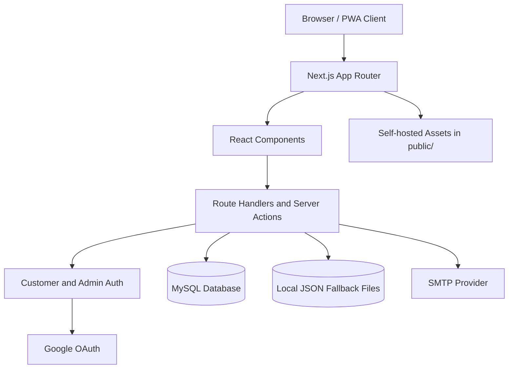
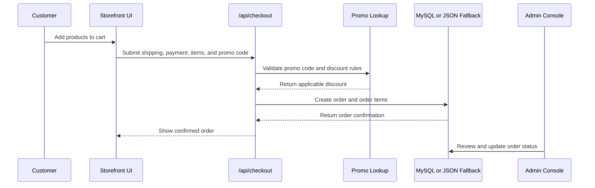

# Apex Performance Gear

Apex Performance Gear is a production-oriented football equipment storefront built with Next.js, TypeScript, Tailwind CSS v4, MySQL, and a full admin console. It supports catalog browsing, product detail pages, cart and checkout flows, customer authentication, Google OAuth, promo codes, order tracking, memberships, testimonials, contact messages, and local fallback persistence for development.

## Table of Contents

- [Features](#features)
- [Architecture](#architecture)
- [Data Flow](#data-flow)
- [Tech Stack](#tech-stack)
- [Requirements](#requirements)
- [Environment Variables](#environment-variables)
- [Local Development](#local-development)
- [Database Setup](#database-setup)
- [Production Build](#production-build)
- [Project Structure](#project-structure)
- [Operational Notes](#operational-notes)
- [Quality Checks](#quality-checks)

## Features

- Customer storefront with home, shop, category, product detail, membership, contact, profile, and order pages.
- Cart state managed with React Context and synchronized to `localStorage`.
- Checkout flow with promo code validation, order creation, order items, discounts, and delivery proof support.
- Customer auth with email/password, email verification, session cookies, and optional Google OAuth.
- Admin console for products, categories, orders, promo codes, testimonials, memberships, and messages.
- Raw MySQL access through `mysql2` with transactional order writes and no ORM dependency.
- JSON fallback persistence for local development when MySQL is unavailable.
- PWA assets, manifest, service worker registration, local fonts, and self-hosted image assets.

## Architecture



## Data Flow



## Tech Stack

| Area | Technology |
| --- | --- |
| Framework | Next.js 16 App Router |
| Language | TypeScript |
| UI | React 19 |
| Styling | Tailwind CSS v4 with CSS-first theme configuration |
| Database | MySQL through `mysql2/promise` |
| Email | Nodemailer with SMTP |
| Icons | Lucide React and self-hosted Material Symbols |
| Motion | Lenis |
| Tooling | ESLint, TypeScript, npm |

## Requirements

- Node.js compatible with Next.js 16.
- npm.
- MySQL 8 or compatible database for production usage.
- SMTP credentials for email verification in deployed environments.
- Google OAuth credentials only if Google sign-in is enabled.

## Environment Variables

Create `.env.local` for local development and configure equivalent environment variables in production.

```env
MYSQL_HOST=localhost
MYSQL_PORT=3306
MYSQL_USER=root
MYSQL_PASSWORD=
MYSQL_DATABASE=apex_pitch

ADMIN_USERNAME=admin
ADMIN_PASSWORD=change-this-password
ADMIN_EMAIL=admin@example.com
ADMIN_SESSION_SECRET=replace-with-a-long-random-secret
CUSTOMER_SESSION_SECRET=replace-with-a-different-long-random-secret

NEXT_PUBLIC_APP_URL=http://localhost:3000

SMTP_HOST=
SMTP_PORT=587
SMTP_USER=
SMTP_PASSWORD=
SMTP_FROM_EMAIL=
SMTP_SECURE=false

GOOGLE_CLIENT_ID=
GOOGLE_CLIENT_SECRET=
GOOGLE_REDIRECT_URI=http://localhost:3000/api/auth/google/callback
```

Production deployments should use strong unique secrets for `ADMIN_SESSION_SECRET` and `CUSTOMER_SESSION_SECRET`. Do not rely on local development defaults outside a private development machine.

## Local Development

Install dependencies:

```bash
npm install
```

Start the development server:

```bash
npm run dev
```

Open [http://localhost:3000](http://localhost:3000).

The app can run without MySQL during local development. When the database connection is unavailable, data is read from seeded in-memory/static values and persisted to local fallback files such as `.orders_fallback.json`, `.customers_fallback.json`, and related JSON files.

## Database Setup

Create and seed the database:

```bash
mysql -u root -p < database/schema.sql
```

Additional incremental SQL migrations are stored in `database/migrations/`. Apply the relevant migrations when upgrading an existing database rather than reseeding from scratch.

Key tables include:

- `products`, `product_images`, and `product_videos`
- `categories`
- `orders` and `order_items`
- `customers` and `email_verification_tokens`
- `promo_codes`
- `testimonials`
- `contact_messages`
- `membership_applications`
- `site_settings`

## Production Build

Run a production build:

```bash
npm run build
```

Start the built app:

```bash
npm run start
```

Before deploying, confirm that:

- MySQL is reachable from the runtime environment.
- Production environment variables are configured.
- Admin and customer session secrets are long, random, and distinct.
- SMTP is configured if email verification is required.
- `NEXT_PUBLIC_APP_URL` points to the deployed origin.
- Upload and public asset paths are compatible with the hosting platform.

## Project Structure

```text
database/
  schema.sql
  migrations/
public/
  images/
  fonts/
  bank-logos/
  sw.js
src/
  app/
    api/
    admin/
    shop/
    product/
  components/
  context/
  lib/
```

## Operational Notes

- Database access is centralized in `src/lib/db.ts`.
- Authentication helpers live in `src/lib/adminAuth.ts` and `src/lib/customerAuth.ts`.
- Verification email delivery is handled by `src/lib/mailer.ts`.
- Fallback JSON files are development artifacts and should not be treated as a production data store.
- The service worker is registered only in production builds.
- Static images, icons, and fonts are served from `public/` for predictable asset delivery.

## Quality Checks

Run linting:

```bash
npm run lint
```

Run a production build before release:

```bash
npm run build
```
