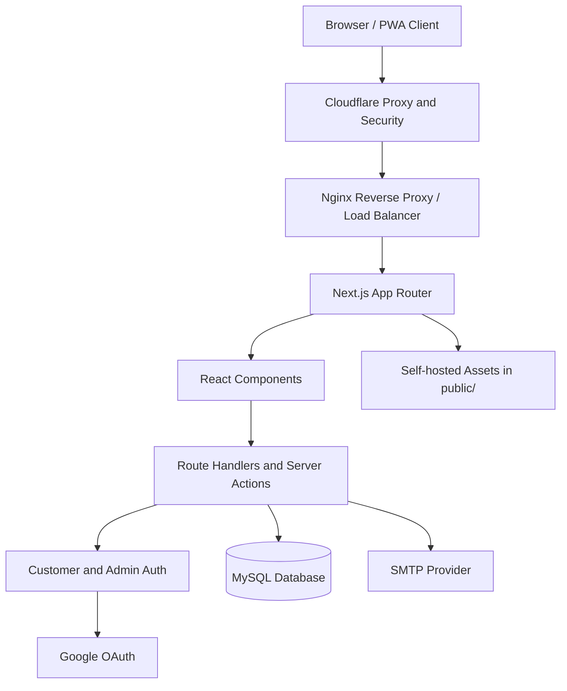
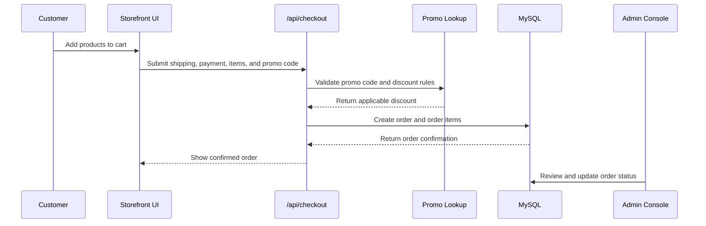
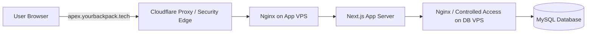

# Apex: The Football Accessories E-Commerce Shop

Apex is a production-oriented football accessories ecommerce storefront built with Next.js, TypeScript, Tailwind CSS v4, MySQL, and a full admin console. It supports catalog browsing, product detail pages, cart and checkout flows, customer authentication, Google OAuth, promo codes, order tracking, memberships, testimonials, and contact messages.

## Table of Contents

- [Features](#features)
- [Market and UX Rationale](#market-and-ux-rationale)
- [Architecture](#architecture)
- [Data Flow](#data-flow)
- [Tech Stack](#tech-stack)
- [Requirements](#requirements)
- [Environment Variables](#environment-variables)
- [Local Development](#local-development)
- [Database Setup](#database-setup)
- [Production Build](#production-build)
- [Production Infrastructure](#production-infrastructure)
- [Project Structure](#project-structure)
- [Operational Notes](#operational-notes)
- [Quality Checks](#quality-checks)

## Features

- Customer storefront with home, shop, category, product detail, membership, contact, profile, and order pages.
- Cart state managed with React Context and synchronized to `localStorage`.
- Checkout flow with promo code validation, order creation, order items, discounts, and delivery proof support.
- Customer auth with email/password, email verification, session cookies, and optional Google OAuth.
- Admin console for products, categories, orders, promo codes, testimonials, memberships, and messages.
- Raw MySQL access through `mysql2` with transactional order writes and no ORM dependency.
- PWA assets, manifest, service worker registration, local fonts, and self-hosted image assets.

## Market and UX Rationale

Apex focuses on football accessories because the category has a clear demand base, repeat purchase potential, and strong fit with technical ecommerce presentation. Football equipment spans performance footwear, apparel, protective gear, balls, and training products, which gives the shop room to sell both high-value hero products and lower-friction add-ons.

The business case is supported by market research:

- Football equipment is a multi-billion-dollar category. TechSci Research estimates the global football equipment market will grow from USD 18.01 billion in 2025 to USD 22.85 billion by 2031 at a 4.05% CAGR. Persistence Market Research projects USD 19.4 billion in 2026 rising to USD 25.0 billion by 2033 at a 3.7% CAGR.
- Broader sporting goods demand is also expanding. McKinsey forecasts global sporting goods industry growth around 6% for 2024-2029, while Mordor Intelligence projects the sporting goods market to reach USD 151.43 billion by 2031 at a 6.11% CAGR.
- The audience is large and global. FIFA's Big Count reported 265 million football players worldwide, and FIFA's women's football reporting shows continued institutional investment in participation growth, including youth competitions growing from 1,717 in 2019 to 4,743 in 2023.
- Ecommerce is a strong channel for this product type. Sporting goods ecommerce benefits from comparison shopping, mobile browsing, direct-to-consumer brand behavior, and product detail pages that can communicate fit, material, size, and performance differences before purchase.

These findings shaped the app's business and UX decisions:

- Product strategy: the catalog combines premium boots, training kit, and accessories so customers can compare technical products while also discovering add-on items with lower purchase resistance.
- Visual positioning: the high-contrast interface, bold typography, and performance-focused imagery are designed to make Apex feel like a technical football shop rather than a generic marketplace.
- Product detail UX: product pages emphasize images, specifications, sizing, traction, colorway, tags, FAQs, and media because football shoppers need confidence around fit and performance before checkout.
- Conversion UX: cart, checkout, promo codes, order tracking, and account history reduce friction across the buying flow and support repeat orders.
- Trust UX: customer authentication, email verification, admin-managed catalog data, testimonials, and visible policy pages strengthen credibility.
- Mobile and PWA UX: responsive layouts, installable app behavior, local assets, and focused navigation support customers who browse from phones before or after training sessions.
- Admin UX: dense CRUD screens for products, categories, promos, testimonials, messages, memberships, and orders keep shop operations fast without needing a separate back-office tool.

UX choices were also informed by ecommerce usability research. Baymard Institute's product-page benchmark reports that many ecommerce product pages still perform at a mediocre level, especially on mobile, which makes strong product information architecture and mobile-first purchase flows a competitive advantage. Baymard's mobile ecommerce research also highlights the complexity of small-screen shopping behavior, supporting Apex's emphasis on compact navigation, clear product cards, responsive checkout, and persistent cart access.

Sources:

- [TechSci Research: Football Equipment Market](https://www.techsciresearch.com/report/football-equipment-market/23209.html)
- [Persistence Market Research: Football Equipment Market](https://www.persistencemarketresearch.com/market-research/football-equipment-market.asp)
- [McKinsey: Sporting Goods Industry Trends 2025](https://www.mckinsey.com/industries/retail/our-insights/sporting-goods-industry-trends)
- [Mordor Intelligence: Sporting Goods Market](https://www.mordorintelligence.com/industry-reports/sporting-goods-market)
- [FIFA Big Count: 265 Million Playing Football](https://condorperformance.com/wp-content/uploads/2020/02/emaga_9384_10704.pdf)
- [FIFA Member Associations Survey Report: Women's Football](https://inside.fifa.com/womens-football/member-associations-survey-report-2023)
- [Baymard Institute: Product Page UX Best Practices](https://baymard.com/blog/current-state-ecommerce-product-page-ux)
- [Baymard Institute: Mobile Ecommerce Usability](https://baymard.com/research/mcommerce-usability)

## Architecture



## Data Flow



## Tech Stack

| Area | Technology |
| --- | --- |
| Framework | Next.js 16 App Router |
| Language | TypeScript |
| UI | React 19 |
| Styling | Tailwind CSS v4 with CSS-first theme configuration |
| Database | MySQL through `mysql2/promise` |
| Email | Nodemailer with SMTP |
| Icons | Lucide React and self-hosted Material Symbols |
| Motion | Lenis |
| Tooling | ESLint, TypeScript, npm |

## Requirements

- Node.js compatible with Next.js 16.
- npm.
- MySQL 8 or compatible database for production usage.
- SMTP credentials for email verification in deployed environments.
- Google OAuth credentials only if Google sign-in is enabled.

## Environment Variables

Create `.env.local` for local development and configure equivalent environment variables in production.

```env
MYSQL_HOST=localhost
MYSQL_PORT=3306
MYSQL_USER=root
MYSQL_PASSWORD=
MYSQL_DATABASE=apex_pitch

ADMIN_USERNAME=admin
ADMIN_PASSWORD=change-this-password
ADMIN_EMAIL=admin@example.com
ADMIN_SESSION_SECRET=replace-with-a-long-random-secret
CUSTOMER_SESSION_SECRET=replace-with-a-different-long-random-secret

NEXT_PUBLIC_APP_URL=http://localhost:3000

SMTP_HOST=
SMTP_PORT=587
SMTP_USER=
SMTP_PASSWORD=
SMTP_FROM_EMAIL=
SMTP_SECURE=false

GOOGLE_CLIENT_ID=
GOOGLE_CLIENT_SECRET=
GOOGLE_REDIRECT_URI=http://localhost:3000/api/auth/google/callback
```

Production deployments should use strong unique secrets for `ADMIN_SESSION_SECRET` and `CUSTOMER_SESSION_SECRET`. Do not rely on local development defaults outside a private development machine.

## Local Development

Install dependencies:

```bash
npm install
```

Start the development server:

```bash
npm run dev
```

Open [http://localhost:3000](http://localhost:3000).

The app requires MySQL for local development and production. Load `database/schema.sql` before starting the app so catalog, auth, checkout, and admin workflows have a database available.

## Database Setup

Create and seed the database:

```bash
mysql -u root -p < database/schema.sql
```

Additional incremental SQL migrations are stored in `database/migrations/`. Apply the relevant migrations when upgrading an existing database rather than reseeding from scratch.

Key tables include:

- `products`, `product_images`, and `product_videos`
- `categories`
- `orders` and `order_items`
- `customers` and `email_verification_tokens`
- `promo_codes`
- `testimonials`
- `contact_messages`
- `membership_applications`
- `site_settings`

## Production Build

Run a production build:

```bash
npm run build
```

Start the built app:

```bash
npm run start
```

Before deploying, confirm that:

- MySQL is reachable from the runtime environment.
- Production environment variables are configured.
- Admin and customer session secrets are long, random, and distinct.
- SMTP is configured if email verification is required.
- `NEXT_PUBLIC_APP_URL` points to the deployed origin.
- Upload and public asset paths are compatible with the hosting platform.

## Production Infrastructure

The production site is served at [https://apex.yourbackpack.tech](https://apex.yourbackpack.tech).

Traffic is routed through Cloudflare with proxying enabled. Cloudflare acts as the public edge for DNS, TLS, and baseline security controls, while hiding the real origin server IP address from normal public DNS lookups. This reduces direct exposure of the Hostinger servers and ensures requests reach the infrastructure through the Cloudflare edge instead of directly targeting the origin.

Behind Cloudflare, Nginx is used as the reverse proxy and load balancer. Nginx terminates and routes inbound application traffic to the app server, while keeping the deployment layout flexible for scaling, maintenance, and controlled upstream routing.

The deployment uses two Hostinger KVM 1 VPS plans:

- App server: runs the Next.js application runtime behind Nginx.
- Database server: runs MySQL behind Nginx-controlled internal routing and firewall rules.



## Project Structure

```text
database/
  schema.sql
  migrations/
public/
  images/
  fonts/
  bank-logos/
  sw.js
src/
  app/
    api/
    admin/
    shop/
    product/
  components/
  context/
  lib/
```

## Operational Notes

- Database access is centralized in `src/lib/db.ts`.
- Authentication helpers live in `src/lib/adminAuth.ts` and `src/lib/customerAuth.ts`.
- Verification email delivery is handled by `src/lib/mailer.ts`.
- MySQL is required for all persistent data access; the app does not maintain local JSON data stores.
- The service worker is registered only in production builds.
- Static images, icons, and fonts are served from `public/` for predictable asset delivery.

## Quality Checks

Run linting:

```bash
npm run lint
```

Run a production build before release:

```bash
npm run build
```
